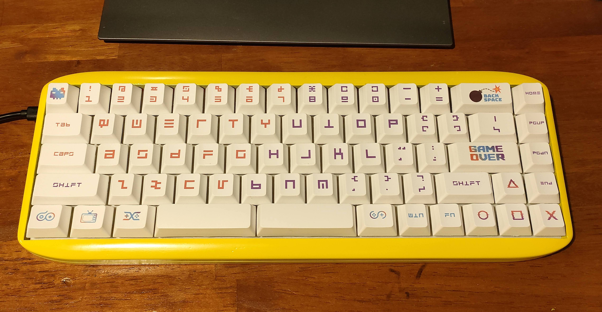
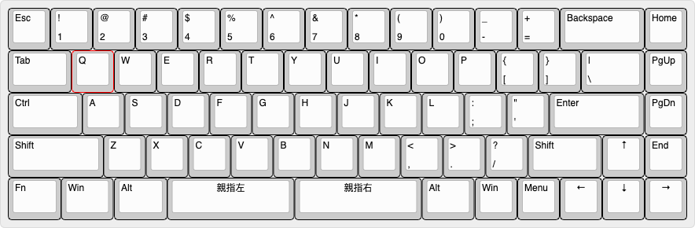

## TS69 親指シフト入力用 68% キーボード

分割3uスペースキーをもつ 68% キーボード  
  

## 必要なもの

* 基板 (製造サービスなどに発注)
* Pro Micro
* ピンヘッダ12ピン×2
* 6x 鬼目ナットM3 Aタイプ(打ち込み) 深さ5.5mm [モノタロウ](https://www.monotaro.com/p/4175/4824/)
* 6x M3キャップボルト
* 69x キースイッチ
* スタビライザー (3x2u, 2x3u)
* キーキャップ 2x 3uスペース
* ガスケット (4mm幅×2mm厚のPoronやEVAフォームなどを貼る)
* ケース 3Dプリンタ [データ](case/)
* 定位板 3Dプリンタ もしくは業者にレーザーカッティングをお願いする [データ](plate/)

Pro Microは同等品のType-Cやコンスルー版などのほうが良いかも。MicroUSB版を使うならばコネクタモゲないようにエポキシ接着剤などで補強したほうがよい  

## 製造工程

Pro Microを裏側実装する関係で、実装の順番を間違えると面倒なことになる  
1. 基板にスタビライザーを取り付け
2. 基板にピンヘッダを半田付け
3. 周辺部分のキースイッチを取り付け
4. スタビライザーの動作確認 キースイッチを取り付けてキーキャップを実際に被せてスタビライザーが気持ちよく動くか確認。プレートの精度が十分よければこの手順は必要ないけど、3Dプリンタでプレートを自作する場合、しばしばスタビライザー軸が端に触れて動きが悪くなることがある。もし動きが悪い場合プレートの精度を見直すか、あるいはスタビライザーの動作が悪いキーが嵌まる部分のプレートを削って広げて遊びを作る。
5. キースイッチを全部取り付け
6. Pro Microを取り付け
7. キーキャップを取り付け
8. ケースに入れる

## キー配置

  
バックスペースキーの部分だけカスタマイズ可能だがそれ以外は固定。  
バックスペースキーの場所には2つのキーを割り当てて H*KBのような配置にすることもできる。  
今後親指キーに3u以外(2.75u, 2.25uなど) も使えるようにしたバージョンを作りたかったりはする。  
